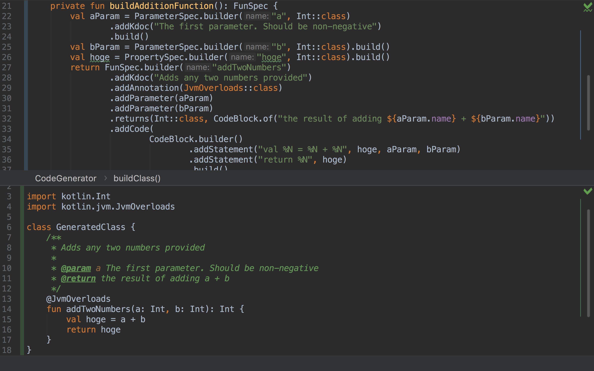

# kotlinpoet-playground
A playground for getting used to KotlinPoet

Lets generate Kotlin code!

The easiest way to generate Kotlin code, is to use [KotlinPoet](https://github.com/square.kotlinpoet).
Kotlin poet has many useful features, but how can we easily see what they all do?

You can use this playground to quickly test KotlinPoet code, and see what is generated

## Usage
The easiest way I found to use this project was to import it into IntelliJ, and open both the `CodeGenerator` and `GeneratedClass` in a split screen.
Then, you can run the `main` function, which will generate the code from the CodeGenerator, and write it to the `GeneratedClass` file.

